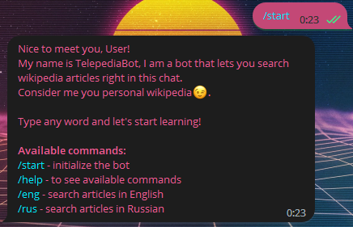
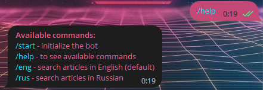
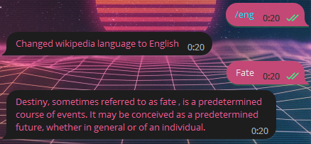
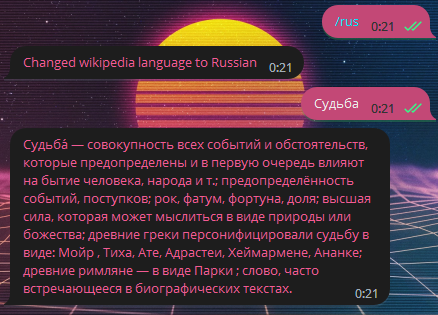

# Telegram Wikipedia Bot

## Description
A bot for using wikipedia right in the telegram app

## How to use the bot

This bot receives your message and does a quick wikipedia search, giving you a short summary.
Available commands:

- `/start` — exchange greetings with the bot:

  

- `/help` — see available commands:

  

- `/eng` search articles in English:

  

- `/rus` — search articles in Russian:

  


## Getting started

### Setting up credentials

First, go to the [BotFather](https://t.me/BotFather) and get your own bot token.
After that, you need to input it to `API_TOKEN` variable in `main.py`.

### Run the app with Docker

To run the bot with Docker, just follow this steps.

First, build Docker image:

```
docker build -t telepediabot .
```

Then, run the application:

```
docker run telepediabot
```

### Running without Docker

To begin, clone this repository:
```
git clone https://github.com/denis-shvetcov/telegram-wikipedia.git
```
Then follow this steps:
- Get Python `ver. 3.10` or newer
- Run the requirements installation `pip install -r requirements.txt`
- Run the main file `python main.py`

Now you're all set. Have fun.

